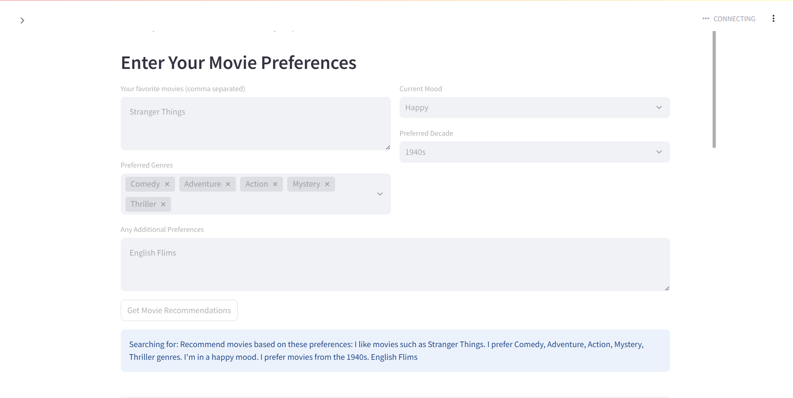
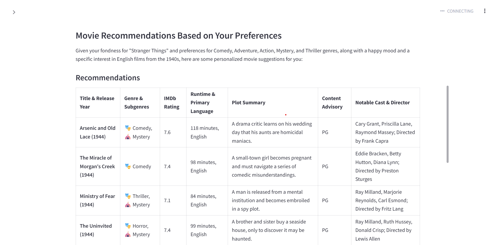

# 🎬 CineMate - AI Movie Recommender 🍿  

CineMate is an **AI-powered movie recommendation app** that helps you discover your next favorite movie based on your preferences! 💡🎥  
It uses **Groq LLM** for intelligent language processing and **Exa Search API** for movie data retrieval, ensuring you get the best personalized recommendations.  

---

## ✨ Features 🚀  

✅ **Personalized Movie Recommendations** based on your:  
- 🎥 **Favorite Movies**  
- 🎭 **Genres**  
- 😀 **Current Mood**  
- ⏳ **Preferred Decade**  

✅ **Powered by AI**: Uses **Groq LLM** and **Exa Search API** for intelligent and fast recommendations.  

✅ **Detailed Movie Information**:   
- 🎞 **Plot Summary**  
- ⏱ **Runtime**  
- 🎬 **Director & Cast**  
- ⚠ **Content Advisory**  

✅ **Download Recommendations**: Export your recommendations as a **Markdown file** for future reference.  

✅ **Simple & User-Friendly Interface**: Built with **Streamlit** for easy interaction.  

---

## 📸 App Screenshot  
Here’s a preview of the app interface:  

  
  

🍿 Sit back, grab some popcorn, and let **CineMate** recommend your next watch! 🎥🎞️ 
---

## 💻 How to Run This Project Locally 🚀  

### ✅ Step 1: Clone the Repository  
```bash
git clone https://github.com/gomesjonathan99/movie-recommendation-agent.git  
cd movie-recommendation-agent
```
✅ Step 2: Install Dependencies
```bash
pip install -r requirements.txt
```
✅ Step 3: Add Your API Keys
Create a .env file in the root directory and add your API keys:
```bash
EXA_API_KEY=your-exa-api-key  
GROQ_API_KEY=your-groq-api-key
```
✅ Step 4: Run the App
```bash
streamlit run streamlit_app.py
```
